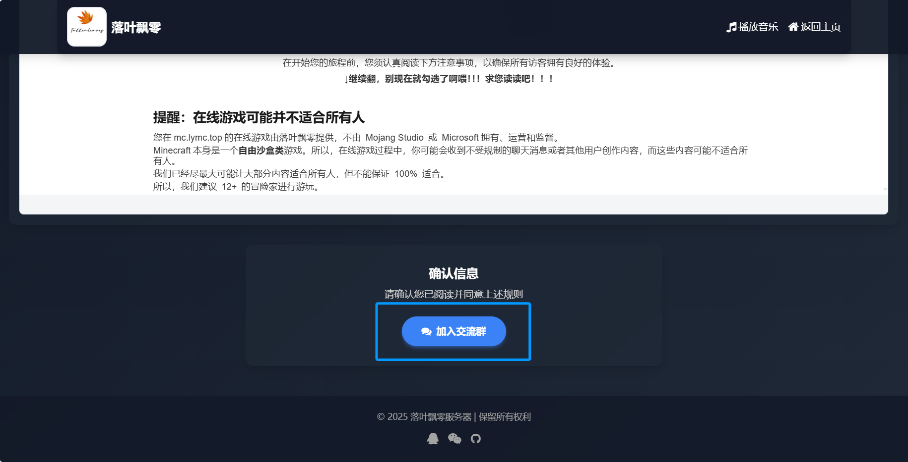

# 加入服务器

编辑：mx@落叶飘零

欢迎来到落叶飘零！

我们只需要以下几个步骤！超级简单

## 环境确认
你需要具备以下条件：

 -  Windows 7+ 环境且已经安装 .NET（仍建议Windows 10+）

 -  需要有大约 3 G 的空间用来下载Minecraft。

 -  Happy Happy Happy！

## 服务器规则阅读

为了保证服务器内所有人都阅读过服务器规则，我们设置了这个环节！

不过，你只需要读一下就好！

点击[这里](https://lymc.top/whitelist)，你将会看见这个页面：

请仔细阅读此处的服务器规则。
阅读完成后，滑动到页面底部，选择“加入交流群”
> 如果你读这个规则都没有超过15秒，洛夜会在后台怀疑你有没有认真读，显示一条警告信息
> 
> 我的建议是你回去读一遍......

随后，按照QQ软件的指示，进入交流群。（这步你应该会了？）

我们就可以进入第二部分

......没时间写了 先提交。